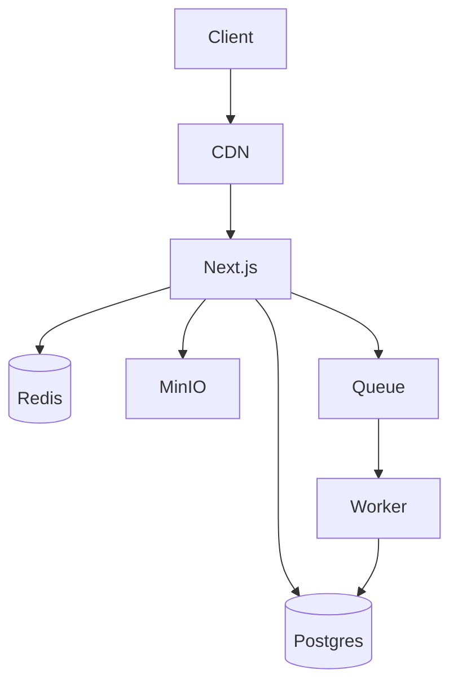

# Atlas — REFERENCE (deep dive)

Deep methods, snippets, conventions — extracted from SKILL.md (progressive disclosure).

## Principles — full

1. **Simplicity first** — the simplest thing that meets the requirement
2. **Boring technology** — proven > novel
3. **Monolith first** — microservices only when monolith breaks
4. **Design for change** — easy to add / remove / swap pieces
5. **Data outlives code** — DB schema > application logic

Heuristics:
- Can avoid distributed → avoid. Postgres instead of a new specialty tool → use Postgres.
- Don't know if you need scale → you don't need it yet.
- Change requires coordinating >2 teams = bad design. Can't explain in 5 minutes = too complex.

## System design

### Monorepo (Next.js)
```
apps/{web,admin}/
packages/{db,ui,config,utils}/
docker-compose.yml | turbo.json
```

### tRPC API
```
src/server/{routers/{user,project,_app}.ts, trpc.ts, auth.ts}
src/lib/{db,redis}.ts
```

### Event-driven (when needed)
Producer → MQ (Redis/NATS) → Consumer
Use cases: async email, webhook processing, long-running tasks, cross-service comm.

## DB design

### Schema conventions
```sql
CREATE TABLE users (
  id         UUID PRIMARY KEY DEFAULT gen_random_uuid(),
  email      TEXT NOT NULL UNIQUE,
  name       TEXT NOT NULL,
  role       TEXT NOT NULL DEFAULT 'user' CHECK (role IN ('user','admin')),
  created_at TIMESTAMPTZ NOT NULL DEFAULT now(),
  updated_at TIMESTAMPTZ NOT NULL DEFAULT now()
);
CREATE TABLE project_members (
  project_id UUID NOT NULL REFERENCES projects(id) ON DELETE CASCADE,
  user_id    UUID NOT NULL REFERENCES users(id) ON DELETE CASCADE,
  role       TEXT NOT NULL DEFAULT 'member',
  PRIMARY KEY (project_id, user_id)
);
CREATE INDEX idx_project_members_user ON project_members(user_id);  -- ALWAYS index FK
```

### Prisma
```prisma
model User {
  id        String   @id @default(uuid()) @db.Uuid
  email     String   @unique
  name      String
  role      UserRole @default(USER)
  createdAt DateTime @default(now()) @map("created_at")
  updatedAt DateTime @updatedAt @map("updated_at")
  projects  ProjectMember[]
  @@map("users")
}
enum UserRole { USER ADMIN }
```

## API design

### REST
```
GET    /api/v1/projects           # list paginated
GET    /api/v1/projects/:id
POST   /api/v1/projects
PATCH  /api/v1/projects/:id       # partial update
DELETE /api/v1/projects/:id
GET    /api/v1/projects?status=active&sort=-created_at&page=2&limit=20
GET    /api/v1/projects/:id/members
```

### Error format
```json
{ "error": { "code": "VALIDATION_ERROR", "message": "Email is required",
  "details": [{ "field": "email", "message": "Required" }] } }
```

## Auth architecture
```
Client → Next.js Middleware (session check)
  ├── Public → pass
  ├── Auth required → cookie/JWT check
  │   ├── Valid → attach user to context
  │   └── Invalid → /login
  └── Admin required → role check → 403 if not
```
Storage: httpOnly cookie + Redis. Token: JWT (short access + long refresh). Provider: NextAuth / Lucia / custom.

## Diagrams

### Mermaid (in markdown)


### C4 levels
Context (system+actors) | Container (apps/DBs/queues) | Component (modules) | Code (rare)

### Inline SVG architecture
For HTML docs requiring full control:
- Shapes: rectangle (service), cylinder (DB — ellipse+rect+ellipse), diamond (decision — polygon 4), hexagon (external — polygon 6)
- Arrows: `<defs><marker id="arrow"><path d="M 0 0 L 10 5 L 0 10 z"/></marker></defs>` + `<line marker-end="url(#arrow)"/>`
- Semantic colors: services `#667eea` | DB `#48bb78` | cache/queue `#ecc94b` | external `#9f7aea` | errors `#f56565` | connectors `#718096`
- Best practices: prefer `viewBox` over fixed wh, max 500-1000 elements, min stroke 2px, font 11px, text-anchor middle, group `<g>` + transform

When to use: Mermaid → quick md/flowchart/sequence | SVG → full control, custom shapes, HTML docs | Excalidraw → collaboration, brainstorm

## Scalability playbook
```
L0: Single server (monolith+DB)        ~10k users
L1: Separate DB             read replicas, PgBouncer pooling
L2: Caching (Redis)         sessions, hot data, rate limit
L3: CDN+Edge                static, ISR, edge middleware
L4: Horizontal              N app instances, LB, stateless (sessions in Redis)
L5: Event-driven/async      job queues, async webhooks
```
! You don't need L5 until L0 has problems.

## Deliverables
- Diagrams (Mermaid / Excalidraw / SVG)
- DB schema (ERD + SQL/Prisma)
- API contracts (OpenAPI / tRPC types)
- ADR per significant decision
- Migration plan (if refactor)
